# RED VIRTUAL EN AZURE

`Vamos a crear una red virtual en Azure que constará de 2 máquinas virtuales, una en Windows y una en Windows Server 2019.`

### PASO 1: Creación del grupo de recursos

------

Para ello tendremos que irnos a **Inicio** luego a **Grupos de Recursos** y después le damos a **Crear**.

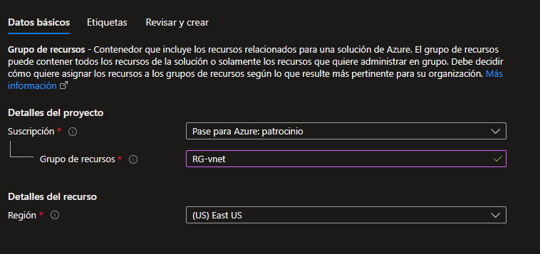

### PASO 2: Creación de máquina virtual Windows Server 2019

------

Una vez dentro de nuestro grupo de recursos creado, nos vamos a **Marketplace** y buscamos nuestra la máquina que queremos instalar, en este caso de **Windows Server 2019 Datacenter**, y le damos a **Crear**.

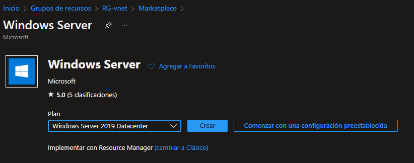

Una vez creada, tendremos que asociar la maquina a nuestro grupo de recursos y poner los datos que veremos a continuación.

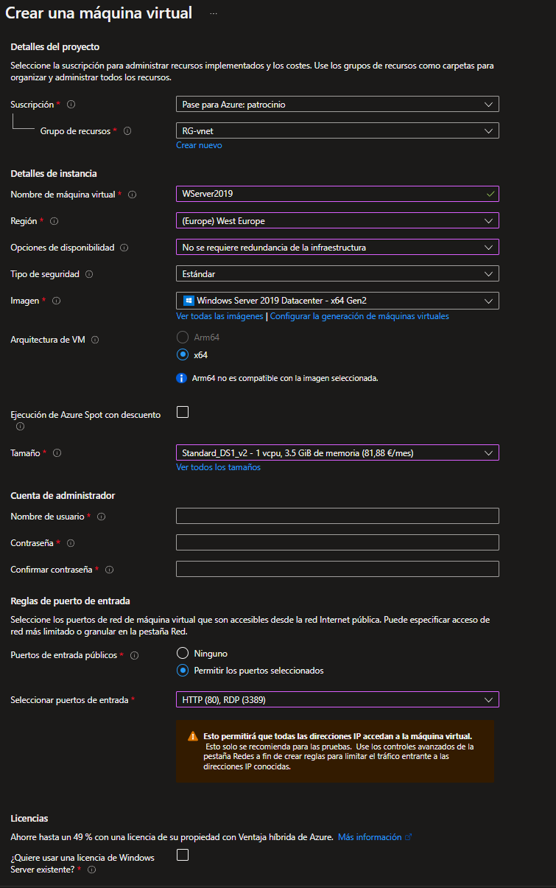

Tendremos que seleccionar los discos de menor facturación y abrir los **puertos 80** y **3389**.

Cuando hayamos rellenado todos estos datos le daremos a siguiente.

En el apartado de **Discos** tendremos que poner el **SSD Estándar**.

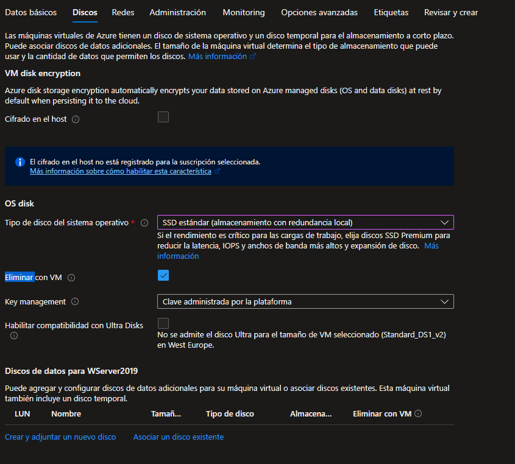

### PASO 3: Creación de la red virtual

------

En el apartado de Redes, como hemos empezado creando la maquina virtual, nos tocara crear nuestra red ahora y asociarle los datos correspondientes.

Tendremos que darle a **Nueva red** y se nos abrirá el siguiente menú donde tendremos que añadir los siguientes datos.

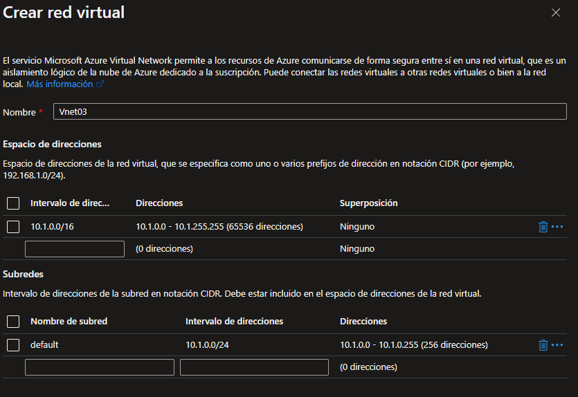

Nombramos a la subred con subnet1 y modificamos el rango de IP a 10.0.0.0/24.

Creamos una IP pública.

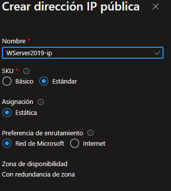

Una vez completados estos campos le damos a siguiente hasta que lleguemos a la pestaña de **Etiquetas**.

Debemos de asociar los recursos a unas etiquetas para poder identificarlos de forma simple, en este caso ponemos de ejemplo que creamos este proyecto para el **Departamento de Marketing**.

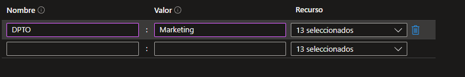

Después de esto le damos a **Revisar** y si esta todo correcto le damos a **Crear**.  

Después de esto tardará unos minutos en crearse y nos saldrá un menú con un resumen de los datos que hemos registrado.

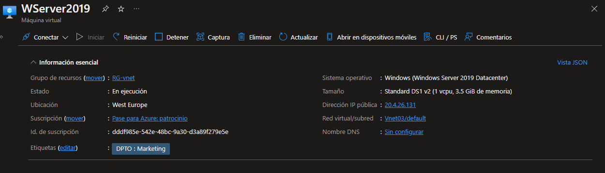

### PASO 4: Creación de máquina virtual de Windows 10

------

Una vez creada nuestra máquina virtual de Windows Server 2019, **creamos** nuestra máquina virtual de **Windows 10** dentro de nuestro grupo de recursos como hicimos anteriormente.

Configuramos la máquina como la anterior **sin abrir el puerto 80** ya que no lo necesitamos.

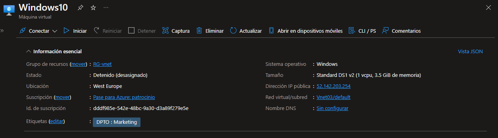

### PASO 5: Windows Admin Center

------

Dentro de la maquina virtual de Windows Server 2019 nos vamos al apartado de **Windows Admin Center**, abrimos los puertos **6516** y seleccionamos las **2 opciones** y le damos a **Instalar**.

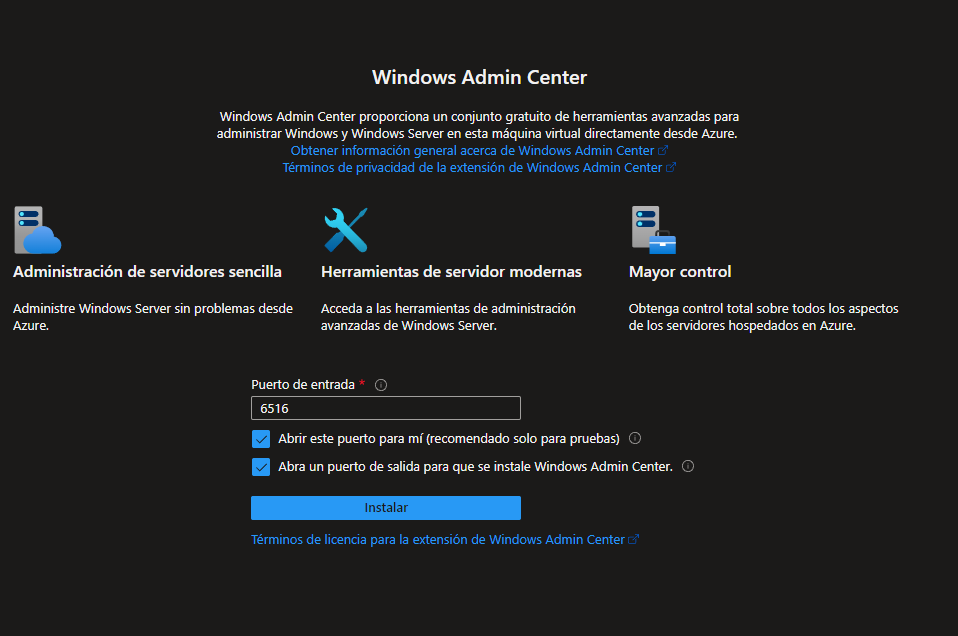

### PASO 6: Instalación de Admin Center

------

También necesitamos instalar Admin Center en nuestra **máquina local**.

A la hora de instalarlo nos puede saltar un error y debemos insertar este comando en nuestro CMD.

***msiexec -i WindowsAdminCenter2211.msi productLanguage="1033"***

### PASO 7: Configuración de Admin Center

------

Una vez instalado, tendremos que asociar el Admin Center de nuestra máquina de Azure con nuestra local gracias al **Tenant ID**.

Una vez que hagamos esto se nos conectará con nuestra cuenta de Azure y tendremos que iniciar sesión e identificar nuestra suscripción, grupo de recursos y máquina.

Por último tendremos que revisar la pertenencia al rol  de **Windows Admin Center Administrator Login Role**.

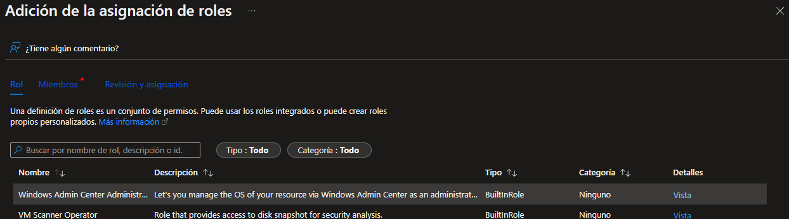

Tendremos que habilitar dentro de nuestras máquinas las **reglas ICMP** para habilitar el ping en LAN entre nuestras máquinas.

Dentro de **Windows Server 2019** añadimos roles y características de **Web Services**.

Comprobamos en LAN y editamos la página a través de esta ruta **C:\inetpub\wwwroot** a través del CMD.

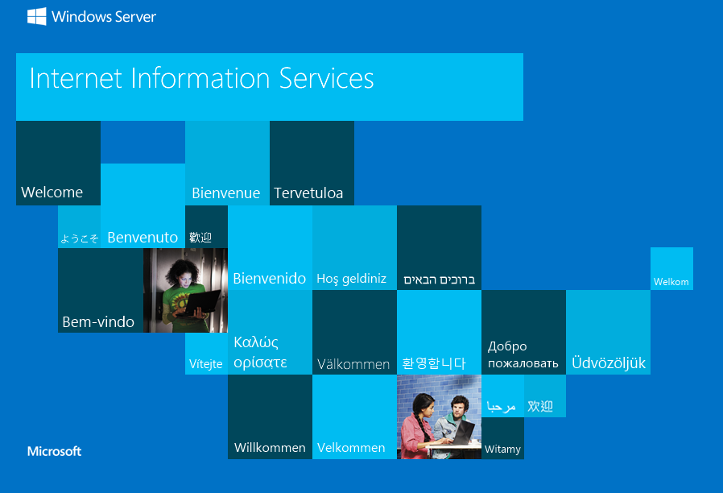

### DIAGRAMA FINAL DE NUESTRA RED VIRTUAL DE AZURE

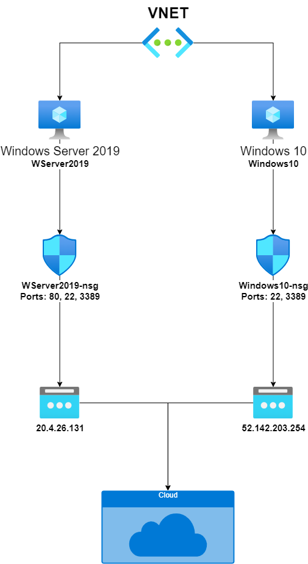

### Controlamos el coste

Apagamos las máquinas y comprobamos que solo tarife el almacenamiento de estas mismas.

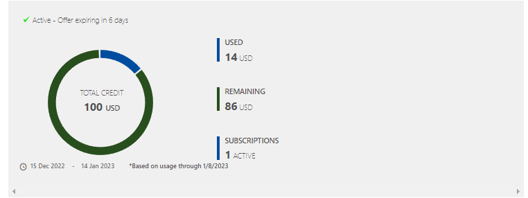